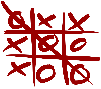

# Juego a realizar

## Ejemplo de output

En el archivo (./Output_ejemplo.txt) encontrarán un ejemplo de output que podría ser desplegado en pantalla. Pueden recrear este o alguno de su gusto.

## Issues

En las [Issues](../../../../issues), encontrarán por separado espacio para que puedan realizar sus preguntas. Además, la [número #8](../../../../issues/8) tiene links útiles que le servirán tanto para comprender lo esencial de C como para realizar el Task 3.